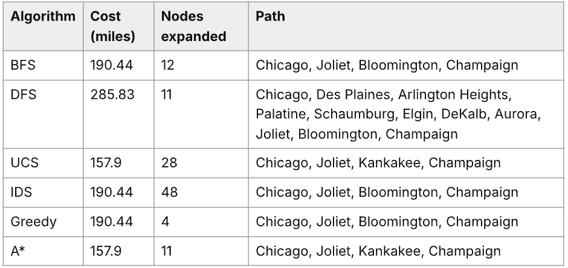

# Project 1 Report: Intelligent Search Visualizer

> [!IMPORTANT]
> **AUTOGRADER COMPLIANCE INSTRUCTIONS:**
> This report is parsed automatically by the autograder. To ensure you receive full credit for your work:
> 1. **Do not modify** the section headers (`## ...`) or bold field keys (e.g., `**Name:**`, `**Selected Region:**`, `**Live Deployment URL:**`, etc.).
> 2. **Write your answers directly after** the colon `:` of each field, replacing the placeholder text completely (including the outer brackets `[` and `]`).
> 3. **Maintain the file structure**. Changing headers, bold titles, or deleting lines can cause the autograder to miss your responses and award 0 marks.

---

## Student Information 
- **Name:** Rudhva Patel
- **UID (netID):** rpate542
- **UIN:** 657512073

---

## Section 1: Selected City Region
- **Selected Region:**  Illinois, USA

---

## Section 2: Map Graph Configuration
- **Total Cities Configured:** 22
- **Total Connection Edges:** 35
- **Graph Fully Connected:** Yes

---

## Section 3: Local Verification & Search Algorithms
*Check the algorithms you successfully ran and verified on your local development server by placing an `x` in the brackets (e.g., `[x]`):*
- [x] Breadth-First Search (BFS)
- [x] Depth-First Search (DFS)
- [x] Uniform Cost Search (UCS)
- [x] Iterative Deepening Search (IDS)
- [x] Greedy Best-First Search (Greedy)
- [x] A* Search (A*)

---

## Section 4: Deployed and Presentation Information
- **Deployment Platform:** Render
- **Live Deployment URL:** https://ai-search-6nxn.onrender.com
- **Video Presentation Link:** https://drive.google.com/file/d/1OFgVJkJ3oeVYrlTYi1XOUi3-tlJnA8Jt/view?usp=sharing

---

## Section 5: Discussion
- **Which search algorithm is best for this route finding problem?** 
    I think A* is the best one for this problem. What we want is the shortest driving distance in miles, so the algorithm has to return the best path, not just any path. 
    Out of the six, only UCS and A* guarantee that on a weighted graph. BFS and IDS find the path with the fewest cities in it, which isn't always the shortest in miles (they only matched the best cost in 284 of 462 city pairs). DFS and Greedy just take whatever route they hit first, and those can be a lot longer. DFS averaged 283.3 miles compared to 95.6 for the best paths.

    A* gives the same answers as UCS but does less work. UCS only knows how far it has already gone, while A* also adds a guess of how far is left, so cities in the wrong direction look expensive and get pushed to the back of the queue.

- **Search Efficiency (Nodes expanded/time taken comparison):**   

    | Algorithm | Avg expanded | Max expanded | Avg time (ms) | Avg cost |
    |-----------|-------------:|-------------:|--------------:|---------:|
    | BFS       |          7.8 |           20 |         0.006 |    108.1 |
    | DFS       |         12.9 |           30 |         0.009 |    283.3 |
    | UCS       |         16.0 |           34 |         0.014 |     95.6 |
    | IDS       |         39.2 |          297 |         0.016 |    108.1 |
    | Greedy    |          4.3 |           11 |         0.014 |    101.0 |
    | A\*       |          6.7 |           21 |         0.019 |     95.6 |

    *Averaged over all 462 ordered source/destination pairs; runtime is the mean of 100 repeated runs per pair.*

    Between the two optimal algorithms, A* expanded fewer nodes than UCS (6.7 vs. 16.0 on average) because the haversine heuristic keeps it from wandering toward cities that lead away from the destination. UCS has to expand every city that is cheaper to reach than the goal, so it spreads out in all directions, whereas A* can predict how far the destination could be. 

    Greedy expanded the fewest nodes of all (4.3 on average) since it only follows the heuristic, but its paths were longer on average (101.0 miles vs. 95.6), and it only found the best path in 344 of 462 pairs. So it's fast, but you give up quality.

    BFS found the fewest-hop path with 7.8 nodes on average, though that isn't always the shortest in miles. DFS expanded a similar amount (12.9) but its paths were really long (283.3 miles on average), because going in alphabetical order rarely points toward the goal. IDS had the most expansions (39.2 on average, 297 at worst) because it redoes the shallow nodes on every depth iteration, and its path-based visited set lets it reach the same city again through different routes.

    Runtime didn't follow the node counts very closely. Everything finishes in well under a millisecond on a 22-city graph, and the cost per node is different. BFS and DFS just use a queue or stack, while UCS, Greedy and A* use a heap, and Greedy and A* also compute haversine distances. Measured runtimes went BFS < DFS < UCS ≈ Greedy < IDS < A*, so A*'s advantage over UCS shows up in nodes expanded and not in wall-clock time here. Greedy and A* are the efficient informed options, but only A* is both efficient and optimal.

- **Link the idea of search algorithm to today Generative AI.** 
    A language model writes text one token at a time, and at every step there are lots of possible next tokens. So generating a response is basically a search through a huge tree of word sequences, kind of like how route finding here is a search through a graph of cities.

    The main thing I took from this project is that uninformed search is simple but wasteful once the space gets big, and a good heuristic is what makes a big space manageable. In generative AI the heuristic is a learned model, so how good it is mostly decides how good and how efficient the output turns out to be.

- **Test Values Used In Video**

